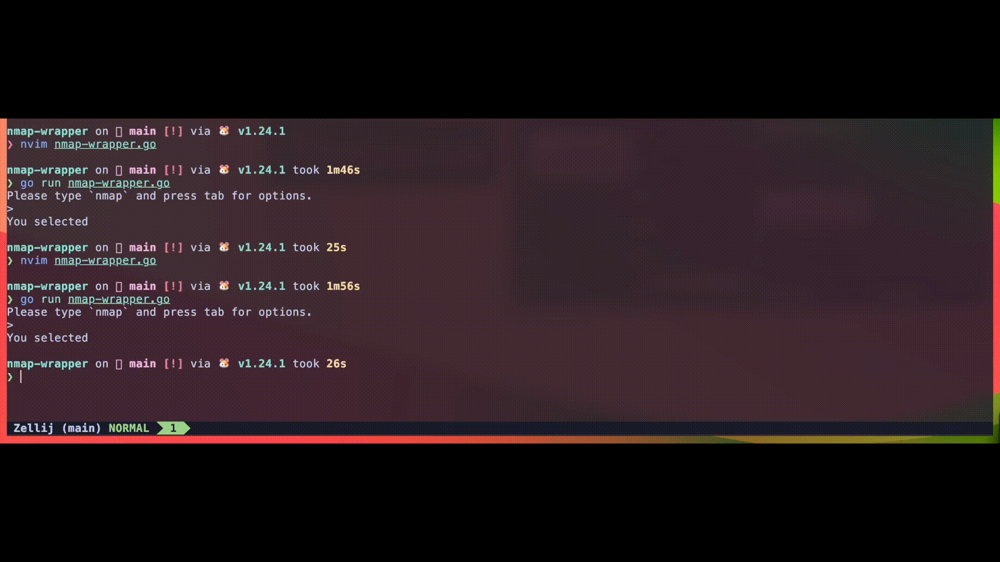

# Nmap Wrapper

## Problem
Currently nmap is difficult to use. There are 115 different flags and those flags take also arguments.

Also there are over 3000 lines in the manpage, which makes it hard to navigate.

## Idea
We plan to make a nmap CLI tool, that will solve these problems.

**HOW????** - you may ask

By providing:
- [ ] Interactive interface
- [ ] Tab completion
- [ ] Inline documentation
- [ ] Smart suggestions
- [ ] maybe additions?

## Proof of concept



## Running the project
```
go run *.go
```

## Used technologies
- [Nmap](https://nmap.org/) (obviously)
- [go-prompt](https://github.com/c-bata/go-prompt) (for creating CLI tool)

## Contibutors
- [Yikizi](https://github.com/Yikizi)
- [RasmusRaasuke](https://github.com/RasmusRaasuke)
